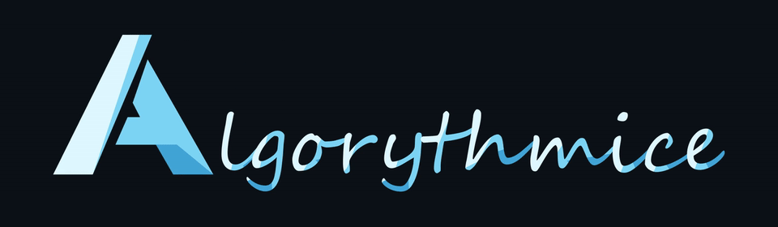

  

Étudiant. Je code surtout en Python et Kotlin, et je m'intéresse à la cybersécurité et à l'IA.

Student. Mostly Python and Kotlin. Interested in cybersecurity and AI.

<!-- STATS:START -->
**12** publics · **9** privés

<!-- PRIVATE_STATS: {"count":9,"verified_on":"2026-10-07"} -->
<!-- STATS:END -->

### Projets / Projects

<!-- PROJECTS:START -->
| Projet / Project | Langage / Language |
| :--- | :--- |
| [Create-New-Industry](https://github.com/algorythmice/Create-New-Industry) | Java |
| [Mini3DEngine](https://github.com/algorythmice/Mini3DEngine) | Kotlin |
| [pronotekt](https://github.com/algorythmice/pronotekt) | Kotlin |
| [PronoteMoyenne](https://github.com/algorythmice/PronoteMoyenne) | Kotlin |
| [RPG](https://github.com/algorythmice/RPG) | C\# |
| [turboself-api](https://github.com/algorythmice/turboself-api) | Kotlin |
| [VoxelEngine](https://github.com/algorythmice/VoxelEngine) | Java |

Autres dépôts / Other repositories (5)

- [algorythmice](https://github.com/algorythmice/algorythmice) — profil / profile
- [Papillon](https://github.com/algorythmice/Papillon) — fork
- [pronotepy](https://github.com/algorythmice/pronotepy) — fork
- [SimCityBuildItBot](https://github.com/algorythmice/SimCityBuildItBot) — fork
- [werkzeug](https://github.com/algorythmice/werkzeug) — fork

<!-- PROJECTS:END -->

[algorythmice@gmail.com](mailto:algorythmice@gmail.com)
